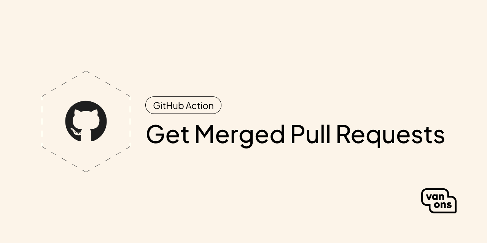

<p align="center"></p>

<!-- start title -->

# GitHub Action: Get Merged Pull Requests

<!-- end title -->

[](https://github.com/VanOns/get-merged-pull-requests-action/actions/workflows/test.yml)
[](https://github.com/VanOns/get-merged-pull-requests-action/blob/main/LICENSE)
[](https://github.com/VanOns/get-merged-pull-requests-action/releases/latest)

<!-- start description -->

Compare two tags and retrieve all the pull requests merged between them.

<!-- end description -->

## Quick start

### Usage

<!-- start usage -->

```yaml
- uses: VanOns/get-merged-pull-requests-action@v1
  with:
    # The GitHub token to use.
    github_token: ""

    # The repository to use. Defaults to current repository. Expected format:
    # `owner/repo`.
    repo: ""

    # The current tag to use. Defaults to current/latest tag.
    current_tag: ""

    # The previous tag to use. Defaults to one tag before the current tag.
    previous_tag: ""

    # The regex to use to determine if a commit is a pull request merge commit. This
    # is checked against a commit's title. Default regex: `^Merge pull request.*`.
    commit_is_pull_request_regex: ""

    # Whether to apply `commit_is_pull_request_regex` to the commits.
    # Default: false
    apply_commit_is_pull_request_regex: ""

    # The regex to use if you want to filter the pull requests. This is checked
    # against a pull request's title. Example regex: `^\[Feat].*`.
    pull_request_regex: ""
```

<!-- end usage -->

### Inputs

<!-- start inputs -->

| **Input**                                | **Description**                                                                                                                                             | **Default**  | **Required** |
|------------------------------------------|-------------------------------------------------------------------------------------------------------------------------------------------------------------|--------------|--------------|
| **`github_token`**                       | The GitHub token to use.                                                                                                                                    |              | **true**     |
| **`repo`**                               | The repository to use. Defaults to current repository. Expected format: `owner/repo`.                                                                       |              | **false**    |
| **`current_tag`**                        | The current tag to use. Defaults to current/latest tag.                                                                                                     |              | **false**    |
| **`previous_tag`**                       | The previous tag to use. Defaults to one tag before the current tag.                                                                                        |              | **false**    |
| **`commit_is_pull_request_regex`**       | The regex to use to determine if a commit is a pull request merge commit. This is checked against a commit's title. Default regex: `^Merge pull request.*`. |              | **false**    |
| **`apply_commit_is_pull_request_regex`** | Whether to apply `commit_is_pull_request_regex` to the commits.                                                                                             |              | **false**    |
| **`pull_request_regex`**                 | The regex to use if you want to filter the pull requests. This is checked against a pull request's title. Example regex: `^\[Feat].*`.                      |              | **false**    |
| **`commit_limit`**                       | Limit the number of commits to retrieve.                                                                                                                    | `250`        | **false**    |

<!-- end inputs -->

## Documentation

Please see the [documentation] for detailed information about installation and usage.

## Contributing

Please see [contributing] for more information about how you can contribute.

## Changelog

Please see [changelog] for more information about what has changed recently.

## Upgrading

Please see [upgrading] for more information about how to upgrade.

## Security

Please see [security] for more information about how we deal with security.

## Credits

We would like to thank the following contributors for their contributions to this project:

- [All Contributors][all-contributors]

## License

The scripts and documentation in this project are released under the [MIT License][license].

---

<p align="center"><a href="https://van-ons.nl/" target="_blank"></a></p>

[documentation]: docs
[contributing]: CONTRIBUTING.md
[changelog]: CHANGELOG.md
[upgrading]: UPGRADING.md
[security]: SECURITY.md
[email]: mailto:opensource@van-ons.nl
[all-contributors]: ../../contributors
[license]: LICENSE.md
